[portfolio](https://mukkss.onrender.com/) &nbsp;·&nbsp;
[linkedin](https://www.linkedin.com/in/mukkss16/) &nbsp;·&nbsp;
[medium](https://medium.com/@muksss1102) &nbsp;·&nbsp;
[email](mailto:mukkss1602@gmail.com)

> Final-year AI & ML Student at Canara Engineering College, India. 
> Building scalable data pipelines & AI agents efficiently.

I build agents that can construct data pipelines in GCP. Right now I am 
deep into PySpark, SQL, Data Modeling, and Multi Cloud architectures. 
Currently seeking Data Engineer / ML Internships & Open Source Projects.

<samp>python &nbsp; go &nbsp; c++ &nbsp; sql &nbsp; pytorch &nbsp; tensorflow &nbsp; fastapi &nbsp; pyspark &nbsp; langchain &nbsp; huggingface &nbsp; aws &nbsp; azure &nbsp; docker &nbsp; kubernetes &nbsp; linux &nbsp; ebpf</samp>

**[AstraLM](#)** &nbsp;·&nbsp; <samp>pytorch, fsdp, mlflow, fastapi, docker</samp> 
Engineered a 130M params decoder-only LLM pretraining platform with custom BPE tokenizer. 
Developed distributed ML infrastructure using DDP/FSDP for 1.8x higher throughput.

**[Sentinel](#)** &nbsp;·&nbsp; <samp>ebpf, scikit-learn, kubernetes, prometheus</samp> 
Kernel-level AI observability platform using eBPF for real-time runtime threat detection. 
Streams ~18K syscalls/sec into an anomaly detection pipeline with < 8.7 ms latency.

**[NeuroLoom](#)** &nbsp;·&nbsp; <samp>react, fastapi, mongodb, adk</samp> 
Multi-agent biomedical research platform using NLI, RAG, and fine-tuned DeBERTa-v3. 
Reduces literature review time by ~40% via semantic retrieval and parallel agent orchestration.

Every graphic here is generated, not embedded from anyone else's server. 
`portrait.svg` is an image pushed through a character ramp by 
[`scripts/generate_ascii.py`](scripts/generate_ascii.py); the stat graphics and 
these section headings are drawn by a scheduled action 
straight from the GitHub GraphQL API, committing only what changed.

They animate with SMIL inside the SVG, because GitHub strips scripts from 
READMEs — and since nothing loads from a third party, nothing here can 
rate-limit or go dark. The headings are SVGs for the same reason: GitHub also 
strips CSS, so an image is the only way to put this page's own typeface on them.

The typeface is JetBrains Mono, subset to just the characters 
each graphic draws and inlined as base64. That isn't only for looks: the 
portrait's grid assumes an advance width of exactly 0.600 em, and a viewer whose 
default monospace is narrower would otherwise see it squeezed.

Language totals cover public repositories only.
